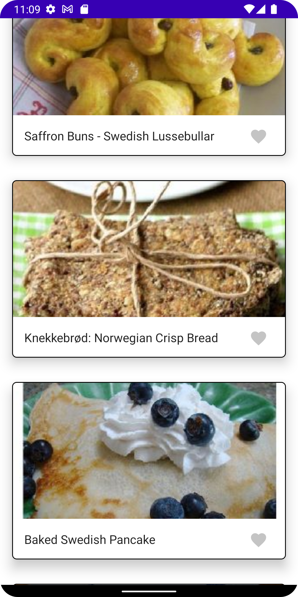

# OpenWeatherMap - Compose Client

## Android
- Kotlin
- Jetpack Compose
- Hilt
- Coroutines
- Flow 
- Retrofit
- OkHttp
- Coil
- MutableStateFlow
- Repository pattern
- SOLID
- Kotlinx Serialization
- Mockito

